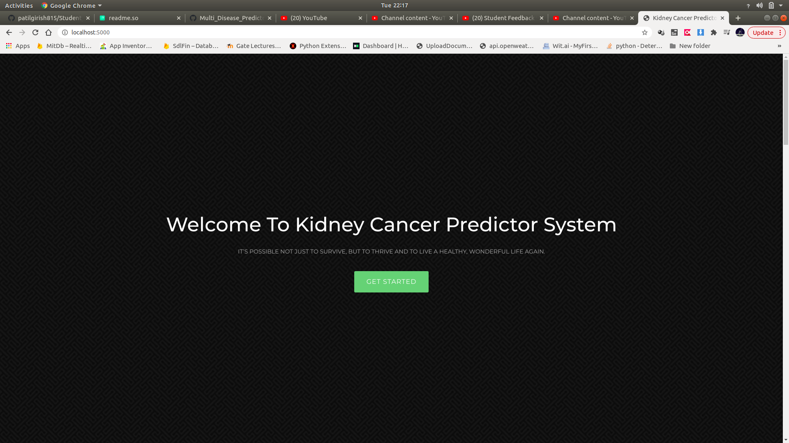
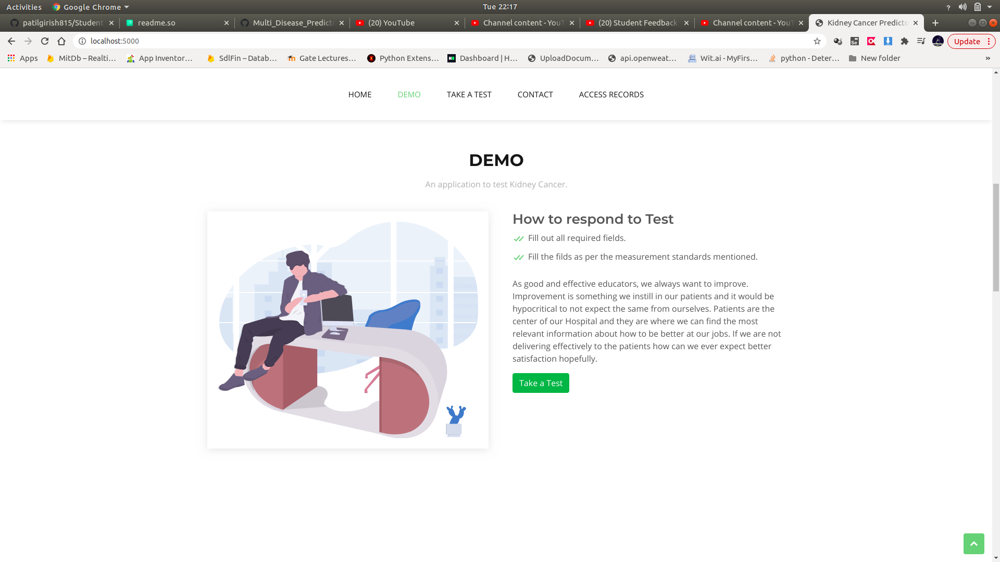
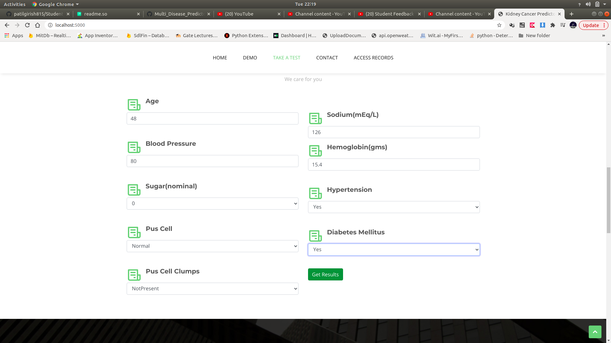
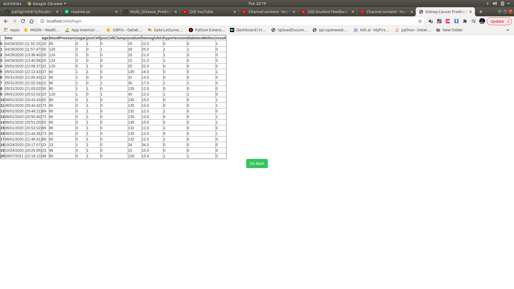

# Kidney_Cancer_Prediction_Using_Machine_Learning
The goal of this project is to develop an automated chronic kidney disease assessment where user can enter some details and can get free assessment based on the input data, The assessments are done with the help of trained machine learning models.

### To run application

1. Install all the libraries
$ pip install -r requirements.txt

2. To run application
$ python server.py

3. Open browser type URL localhost:5000

4. To access stored results Use creadentials 
   Username : admin
   Password : admin

### Demo
link : https://youtu.be/lD63ZzmgQmg

